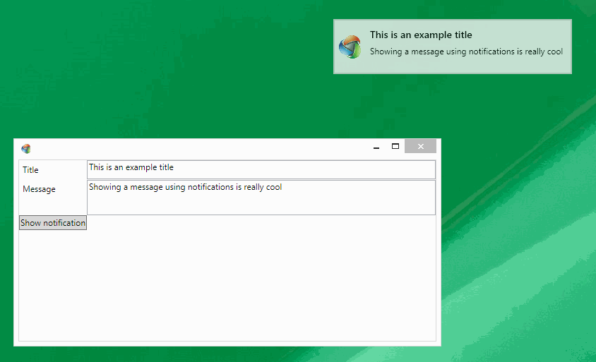

Orc.Notifications
==================

[](https://gitter.im/WildGums/Orc.Notifications?utm_source=badge&utm_medium=badge&utm_campaign=pr-badge&utm_content=badge)


This library is used to create and display desktop notifications. Notification looks like popup windows and will appear on the top right corner of the screen.

Notifications can be used to briefly display important information to the user.



In order to create notifications in your application use IOC with the *INotificationService* interface.

A default *Notification* class, which implements the *INotification* interface is provided.

```c#
public interface INotification
{
        string Title { get; set; }
        string Message { get; set; }
        ICommand Command { get; set; }
        TimeSpan ShowTime { get; set; }
        SolidColorBrush BorderBrush { get; set; }
        SolidColorBrush BackgroundBrush { get; set; }
        SolidColorBrush FontBrush { get; set; }
}
```


